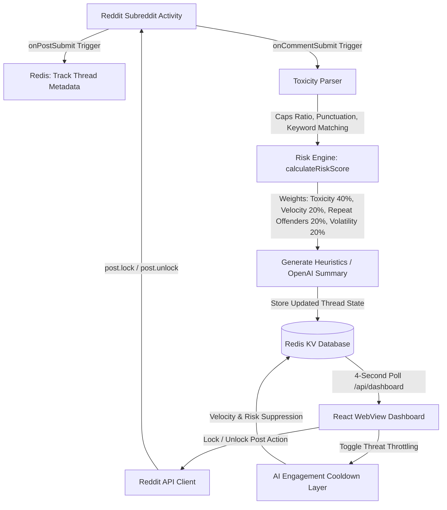

# 🛡️ rShield
### *The AI Immune System for Reddit Communities.*

rShield is a state-of-the-art, real-time AI moderation intelligence platform designed for Reddit. Rather than acting as a simple keyword filter or a passive chat wrapper, rShield operates as **subreddit immune infrastructure**. It continuously monitors discussions, ingests live posts and comments, calculates predictive threat levels, maps conflict participant clusters, and empowers moderators with highly granular containment controls.

---

## 🔮 Product Vision
In the modern web, online discussions escalate from friendly debates to toxic brigades in minutes. Traditional moderation is reactive—relying on manual reports or static keyword blocklists after damage is already done. 

**rShield** represents the future of community defense:
* **Predictive Moderation**: Foresees escalating tensions and brigades *before* they spiral out of control.
* **Cybersecurity Operation Feel**: A dark-mode, neon-accented command cockpit that visualizes live community biometrics and risk heatmaps.
* **Intelligent Cooldowns**: Dynamic, non-intrusive threat throttling to stabilize volatile conversations without shutting down active forums.
* **Automated & Manual Balance**: Operates seamlessly in background-passive mode while providing moderators with one-click containment triggers.

---

## ⚡ Core Feature Matrix

* **📡 Subreddit-Agnostic Ingestion Loop**: Dynamically connects to whichever subreddit the app is installed on. Polling feeds periodically to pull hot submissions.
* **📈 5-Stage Threat Evolution Scale**: Classifies threads into `stable` ➔ `elevated` ➔ `hostile` ➔ `critical` ➔ `containment` levels.
* **🔬 Advanced Comment Intelligence**: Tracks toxicity velocity, reply momentum, controversial keyword density, and repeated offender profiles.
* **🧬 Conflict Cluster Mapping**: Auto-detects alternating back-and-forth arguments (`flamewars`) and coordinated external swarms (`brigading`).
* **🚨 Interactive Simulation Deck**: A six-step cinematic simulation suite enabling developers and judges to test critical escalation and recovery states.
* **🛠️ Direct Moderator Intervention**: Locks/unlocks Reddit threads live, quarantines extreme raid targets, and activates threat-throttling layers.

---

## 📐 System Architecture

rShield is built on a real-time event loop. Below is the system flow showing how live Reddit events, the AI Risk Engine, Redis storage, and the React client dashboard connect:



---

## 🧠 Threat Engine & Live Telemetry

### Mathematical Risk Score
The risk index ($R$) is calculated dynamically using a weighted combination of toxicity score ($T$), reply velocity ($V$), repeat offender count ($O$), and controversial keyword volatility ($K$):

$$R = 0.40T + 0.20V + 0.20O + 0.20K$$

Where:
* **Toxicity ($T$)**: Grammatical toxicity parsed via direct insult patterns, capitalization ratios, and exclamation densities.
* **Velocity ($V$)**: Moving average of comments posted per minute.
* **Repeat Offenders ($O$)**: Count of flagged users with multiple toxic interactions.
* **Volatility ($K$)**: Ratio of comments containing controversial or volatile keywords.

### Threat History Timeline
Each thread stores a historical timeline of threat level shifts, recording the precise timestamp, risk value, and the event trigger that caused the escalation.

---

## 🛠️ Direct Moderation Actions

1. **Lock Thread**: Locks the thread on Reddit using the native Reddit API, suppressing any new comment submissions, and updates client telemetry to locked state.
2. **Unlock Thread**: Unlocks the thread on Reddit, returning the discussion to a monitored, passive status.
3. **Threat Throttling**: Activates a virtual AI engagement cooldown layer. This dampens incoming comment velocity and suppresses risk score escalation.
4. **Containment Quarantine**: Puts the dashboard into a state of visual alert. Heavily dampens risk progression while warning the moderator of severe brigading.

---

## 🎬 Simulation Deck

To demonstrate rShield's intelligence without relying on live rate-limited Reddit traffic, the dashboard features a cinematic simulation panel:
1. **Calm**: Base community chat with positive sentiment.
2. **Spicy Post**: A controversial prompt is submitted, sparking opinion splits.
3. **Heat Rising**: Engagement velocity spikes as emotional rhetoric increases.
4. **Raid/Meltdown**: Multiple repeat offenders join; toxicity peaks into an active flamewar.
5. **Advice Alert**: AI engine runs predictive heuristics and suggests locking the thread.
6. **Restored**: Thread is locked; community metrics stabilize and return to baseline.

---

## 💻 Technology Stack

* **Frontend**: React 19, Tailwind CSS 4, Vite 8
* **Backend**: Node.js v22 (Devvit Serverless Environment), Hono 4
* **Database**: Redis (Devvit KV Storage)
* **AI Engine**: OpenAI API (optional integration for summary heuristics)

---

## 🔌 API Documentation

All endpoints are hosted under `/api/*`:
* `GET /init`: Establishes session, checks moderator user details, runs first-pass subreddit scan, and returns the dashboard state.
* `GET /dashboard`: Returns the main system log entries, subreddit health biometrics, and thread lists.
* `POST /scan`: Manually forces a rescan of the current subreddit's hot posts.
* `POST /thread/:postId/action`: Executes mod policies (lock, unlock, throttle, quarantine).
* `POST /simulation/step`: Sets simulation demo scenarios (1-6).
* `POST /simulation/reset`: Clears simulated debate state and returns to live scanning.

---

## 🚀 Installation & Local Development

### Prerequisites
* Install Node.js (v22+)
* Install the Devvit CLI:
  ```bash
  npm install -g @devvit/cli
  ```

### Configuration
1. Clone the repository and navigate to the directory:
   ```bash
   cd rshield
   ```
2. Copy the environment configuration template:
   ```bash
   cp .env.example .env
   ```
3. Insert your OpenAI API key in `.env` (optional).

### Playtesting Locally
Start the Devvit development playtest environment:
```bash
devvit playtest
```
This starts the local emulator and serves the React frontend on a sandbox port. Follow the terminal prompt to open the dashboard!

---

## 🚢 Deployment Guide

When you are ready to upload the app to Reddit's production servers:
1. Log in to your Reddit Devvit account:
   ```bash
   devvit login
   ```
2. Run build verification:
   ```bash
   npm run lint
   npm run type-check
   npm run build
   ```
3. Deploy the application:
   ```bash
   devvit upload
   ```

---

## 🏆 Hackathon Positioning: Why rShield Matters

Reddit moderators are facing unprecedented burn-out. Existing automod configurations are rigid, frustrating users and failing to detect coordinated conflict patterns.

**rShield** changes this paradigm by introducing **behavior-aware, predictive threat intelligence**. It does not replace human moderators; it acts as their **digital immune shield**. By forecasting flare-ups, detecting coordinated attacks, and presenting highly contextual recommendations inside a premium, real-time command console, rShield sets the standard for the **future of Reddit moderation**.
